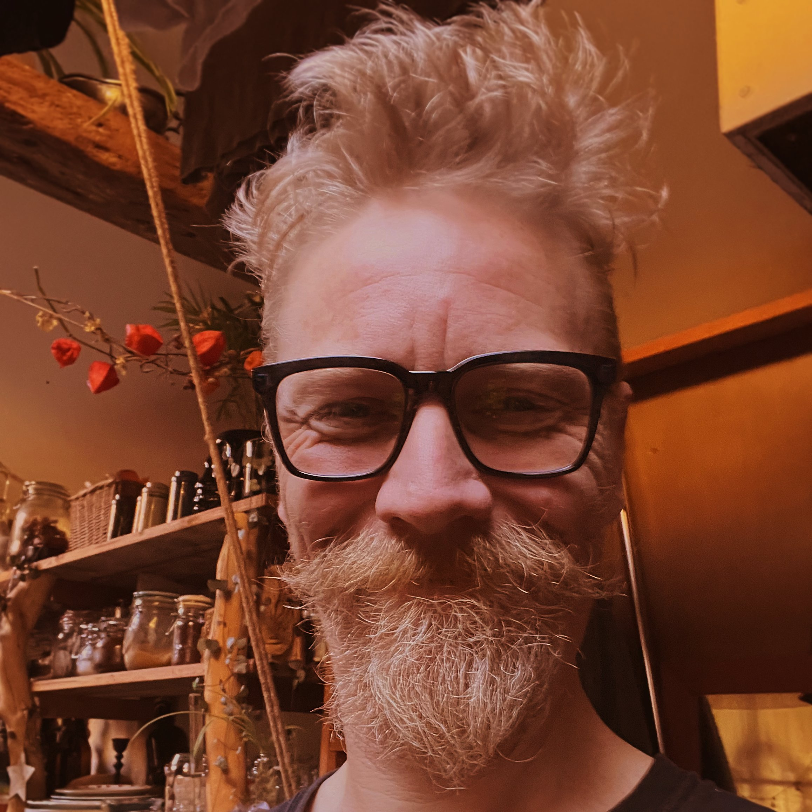

## About Treebeard Creations

<!--  -->

My name is Ben Duxbury and this site is dedicated to try and explain what I do. By trade I am a carpenter, I shall detail some builds and projects over the coming pages. However I also dabble in many other disciplines too, I have spent time as a fabricator, a mechanic as well as spending my youth running bars and music venues around the world. More recently I accidentally fell into education, whilst working on a treehouse project at a forrest type school (hill holt link) I ended up with many of the dissadvantaged youth hanging out and asking pertinant questions, eventually through passing training courses and gaining the qualifications I wrote courses to teach sustainable building techniques by completing actual projects. Having spent a further 2 years teaching it ultimately became apparent that the buraucracy made actually teaching quite a challenge.

My current goal is not to educate but to offer to simply share my knowledge, last year with friends and collegues I helped teach around 100 locals various retrofitting techniques whilst working on and with the local community college (link), my dream would be to manage a tiny house affordable housing project, of which I dedicate a large amount of time to try and decipher the surrounding buraucracy to find a path for actual affordable homes.

If you have a project that doesn't fit the regular molds, would like to know more or share knowledge you think I have missed, please don't hesitate to get in touch.

Thank you.

<!-- We promote hands on tinkering to build a feeling of empowerment and possibility about technology and to kick start conversations on environmental and ethical approaches. -->
